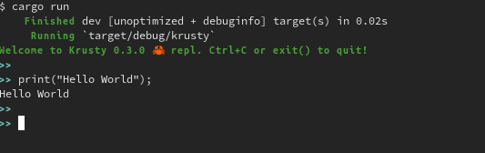
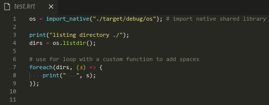

# Krusty! :crab:

An exercise in learning Rust programming language along with learning how to write a programming language by writing Krusty, an interpretted programming language written in Rust. :grin:

P.S. Still too many bugs, but making it public anyway

# Running
- First install [Rust](https://www.rust-lang.org/tools/install), duh
- Clone this repository
- Run it with `cargo run`

# Examples
Krusty program files should use `.krt` extension.
Checkout example Krusty programs in the `test_code` folder. Run them with `cargo run <path/to/program>`

Save the file as `test.krt` and run with `cargo run test.krt`

# Syntax Highlighting
Install VSCode extension for Krusty syntax support at [vscode-krusty](https://github.com/shashfrankenstien/vscode-krusty)
